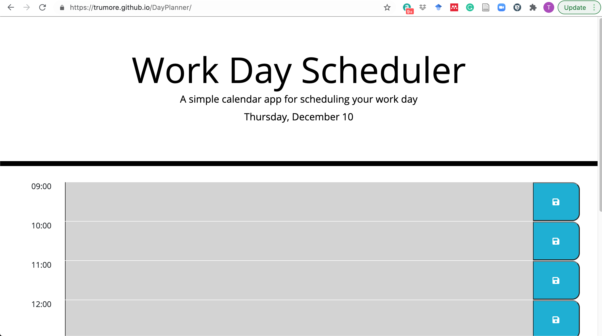

# DayPlanner

Purpose - The purpose of this application was to design an application to allow for the scheduling of one full working day by the hour.

Instructions - Each hour of the work day is broken out into its own block as a textarea element. The user enters information into the block and then clicks the save button at the end of the corresponding hour's row. Upon clicking save, the information is then stored locally so that the information is still displayed upon reloading of the page. Additionally, by virtue of a link to luxon, the current hour's block will be highlighted in green, future blocks are red, and past blocks are grey.

Built using: HTML, CSS, and Javascript utilizing Jquery, Luxon, and Font Awesome.

link to page: https://trumore.github.io/DayPlanner/

Screenshot:

Credits - Built by Tom Rumore and with collaboration by the Columbia FullStack Study Group
